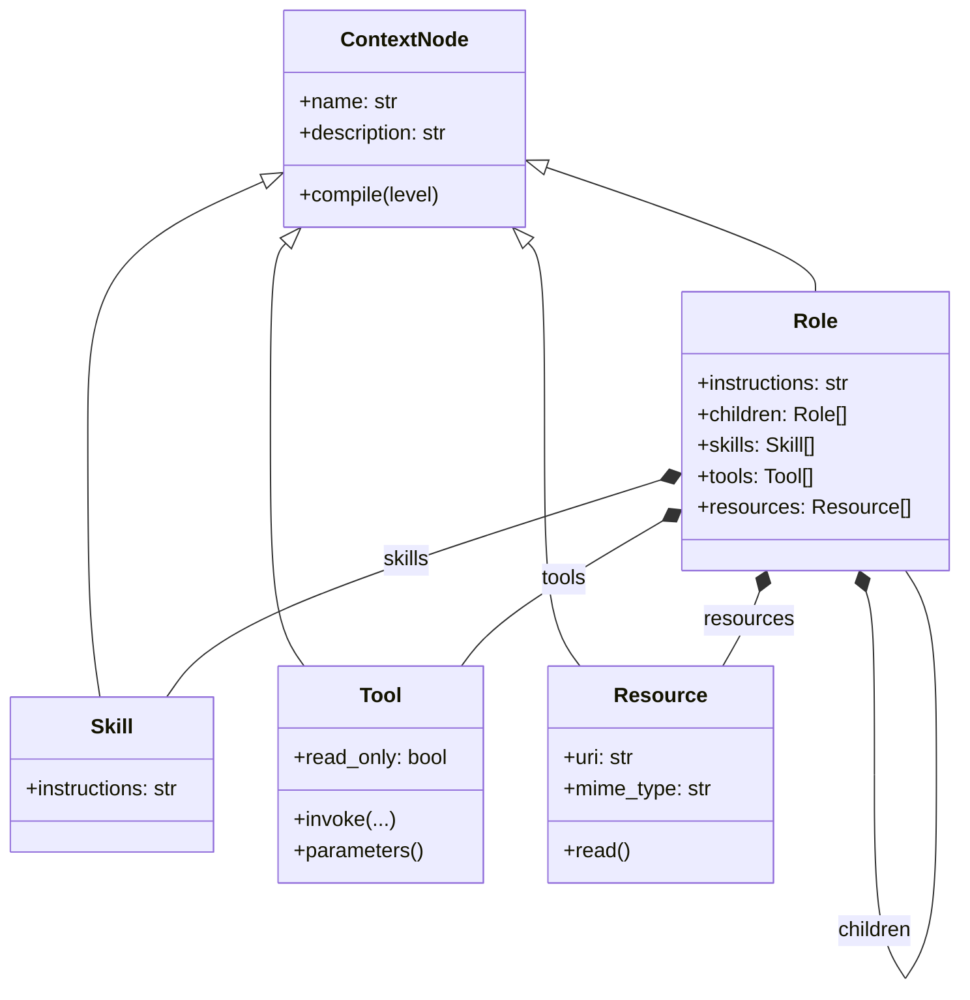

# Design 01 — Progressive Role Object Model

> Scope note: this document covers the **object model** — what a Role is, what
> it may reach, and how much becomes visible at each disclosure level. The
> framework built around it (class-syntax declaration, target adapters, the
> layer boundaries, the server) is [Design 02](02-framework-layers.md).

## 1. Purpose

This document records the design reasoning behind the object model at the
center of Contexture. It begins with the members introduced during the
incremental design sequence and then shows how those members fit into the
terminal architecture.

The design targets Python and uses the Model Context Protocol revision
`2026-07-28`, whose wire messages use JSON-RPC 2.0.

The most important architectural separation is:

```text
MCP defines how an agent runtime reaches a capability provider.
This project defines how a provider organizes its capabilities into Roles.
```

`Role`, `Skill`, `ContextNode`, `ref`, and the compile levels are model-layer
concepts. They are not additions to the MCP wire protocol, and none of them
appears on it: the protocol surface stays flat, and the tree travels inside the
payload of two framework tools.

Tools and Resources are the two capability kinds MCP defines, and this model
deliberately has no third kind beside them — see §4.1.

## 2. Design goals

The model should satisfy six goals.

1. A Role must be an ordinary Python object.
2. A Role may contain child Roles through object composition.
3. A Role may reuse Skills without copying their implementation knowledge.
4. A Role owns the tools and resources it declares, and no others.
5. The Host must progressively expose context instead of loading the complete
   team, every Skill, and every Tool schema at once.
6. One compile interface should work across different context-node types.

The model should remain understandable before adding registries, transports,
policy engines, persistence, or distributed execution.

## 3. Protocol baseline

The formal MCP `2026-07-28` revision is stateless at the protocol core. Every
request is self-contained and carries its protocol version and client
capabilities. MCP messages use JSON-RPC 2.0.

For Tools, the protocol defines concepts such as:

- `tools/list`
- `tools/call`
- Tool `name`
- optional Tool `description`
- required Tool `inputSchema`
- optional Tool `outputSchema`
- optional Tool annotations

The Role model does not redefine these fields. A `Tool` states the operation in
Python and lets the server layer derive the protocol shape from it, so the wire
form has exactly one author.

## 4. The vocabulary

| Type | Question answered | Primary responsibility |
|---|---|---|
| `Role` | Who owns this responsibility? | Coordinate a bounded area of work. |
| `Skill` | How should this class of work be performed? | Supply reusable workflow knowledge. |
| `Tool` | Which operation can this Role run? | Execute one typed Python method. |
| `Resource` | Which content can this Role read? | Address content without loading it. |
| `RoleCompiler` | What should enter the current LLM context? | Produce a progressive context representation. |
| `RoleRegistry` | Where does this role path lead? | Resolve paths and reject cycles. |
| `DisclosureEngine` | Where is the agent, and what is next? | Answer discover and get_context over refs. |

A useful shorthand is:

```text
Role       = who
Skill      = how
Tool       = executable operation
Resource   = readable context
Compiler   = context disclosure
Discovery  = navigation over the declared graph
```

### 4.1 Why there is no separate Data type

An earlier revision of this model carried its own `DataSource`, `DataBinding`,
and `DataProvider` types beside the MCP ones. That produced two parallel
least-privilege systems answering the same question — which external thing may
this Role touch — with two grant formats, two runtime paths, and two places to
audit.

MCP already defines Resources for exactly this purpose. The host-layer Data
types were therefore removed and every form of contextual information —
documents, configuration, knowledge, runbooks — is now declared as a
`Resource`, whose `read()` produces the content when something asks for it.

A data source with an awkward shape is wrapped by a `Resource` subclass, not by
reintroducing a second abstraction beside it.

## 5. Step 1: Role as a recursive composite

The first model required only three members:

```python
@dataclass
class Role:
    name: str
    description: str
    children: list["Role"]
```

`children` is the key object-oriented decision. A child Role is a member object,
not necessarily a Python subclass.

```text
engineering-team
├── k8s-troubleshooter
├── k8s-operator
└── github-liaison
```

This is composition. It models an operational team structure directly and
allows the same Role type to represent every level of the tree.

Python inheritance would answer a different question:

```text
Is FinancialResearcher a specialized kind of Researcher?
```

Composition answers the team question:

```text
Does ResearchLead contain and coordinate Researcher Roles?
```

The team model primarily needs composition.

## 6. Step 2: routing description versus active instructions

A single prompt field is insufficient because routing and execution have
opposite context requirements.

- `description` should be small and broadly visible.
- `instructions` may be detailed and should become visible only after the Role
  is selected.

```text
description  = when should the Host or model select this Role?
instructions = how should the selected Role behave?
```

This distinction is the foundation of progressive disclosure.

## 7. Step 3: Skill as reusable workflow knowledge

A Role owns a responsibility, but a Skill contains a reusable method.

For example:

```text
Role:  k8s-troubleshooter
Skill: inspect-pod-failure
```

The Skill can explain a sequence such as:

1. Inspect Pod status.
2. Read current logs.
3. Read previous logs after a restart.
4. Inspect Events.
5. Correlate the evidence.

The Skill does not need to own the external functions that perform those steps.
It can guide the model to use several MCP Tools, possibly from several Servers.

This separation prevents workflow knowledge from being copied into every Role
or hard-coded into Tool implementations.

## 8. Step 4: ContextNode and the uniform lifecycle

Once both Role and Skill needed the same route-versus-active lifecycle, the
model introduced `ContextNode`.

```python
class ContextNode(ABC):
    name: str
    description: str

    def compile(self, level): ...
    def _compile_route(self): ...
    @abstractmethod
    def _compile_active(self): ...
```

The base class deliberately does not own every field that happens to appear in
current subclasses.

For example:

- Role active context contains `instructions` plus child routes.
- Skill active context contains `instructions`.
- MCP Tool active context contains `inputSchema`, not instructions.
- MCP Resource active context contains a URI and media type, never content.

The stable abstraction is the lifecycle, not a forced universal payload.

This supports polymorphism:

```python
node.compile("route")
node.compile("active")
```

The caller does not need a growing `isinstance` chain for Role, Skill, Tool, and
Resource.

## 9. The two compile levels

### 9.1 Route level

The route level is intentionally small:

```json
{
  "kind": "mcp_tool",
  "name": "get_pod_logs",
  "description": "Read logs from a Kubernetes Pod container."
}
```

Its purpose is selection, not execution.

### 9.2 Active level

The active level reveals type-specific details. An active MCP Tool exposes its
schema:

```json
{
  "kind": "mcp_tool",
  "name": "get_pod_logs",
  "description": "Read logs from a Kubernetes Pod container.",
  "inputSchema": {
    "type": "object",
    "properties": {
      "namespace": { "type": "string" },
      "pod": { "type": "string" }
    }
  }
}
```

An active Role does not recursively activate all descendants. It exposes:

- its own instructions;
- direct child Role route cards;
- Skill route cards;
- granted MCP Tool route cards;
- granted MCP Resource route cards.

This invariant prevents an accidental full-tree context expansion.

## 10. Why `kind` belongs in the route card

Before Tools existed, a route card containing only `name` and `description` was
sufficient. Once a Role could expose child Roles, Skills, Tools, and Resources,
the Host needed to know how the selected item should be activated.

```json
{
  "kind": "skill",
  "name": "inspect-pod-failure",
  "description": "Diagnose a failing Pod."
}
```

`kind` is a Host routing field. It is not an MCP Tool field added to the wire
protocol.

## 11. Step 5: Tool as a ContextNode

A `Tool` is a capability this application owns and can execute. It is stated as
a typed Python method:

```python
class GetPodLogs(Tool):
    """Return recent container logs for one Pod."""

    name = "get_pod_logs"
    read_only = True

    async def invoke(self, namespace: str, pod: str) -> str:
        ...
```

Nothing here writes a JSON Schema. The schema published in `tools/list` is
derived from `invoke`'s type hints when the graph is projected onto a server,
which is why this layer never has to know what JSON Schema looks like.

A Tool's route card carries its name and description. Its active surface adds
the parameter names and the `read_only` classification — not the full schema,
because a connected agent already received that from the protocol, and
repeating it inside a disclosure payload would spend context on something the
host has handed over anyway.

```text
Tool describes and performs one operation.
The server layer derives its schema and carries the call.
```

## 11.1 Resource as a ContextNode

A `Resource` is content this application produces:

```python
class CrashLoopRunbook(Resource):
    """How to diagnose a container that keeps restarting."""

    uri = "contexture://runbooks/crash-loop-backoff"
    mime_type = "text/markdown"

    async def read(self) -> str:
        ...
```

The disclosure boundary that matters for a Resource is not route versus active
but **descriptor versus content**. Its route card carries the routing name and
description; its active surface adds the URI and media type. Neither level ever
carries bytes: `read()` runs only when something performs `resources/read`.

```text
Compiling a Resource yields metadata.
Reading a Resource yields content.
```

This is the whole reason a resource is a resource rather than a paragraph
pasted into a Skill. Discovering a hundred runbooks costs a hundred
descriptions, not a hundred documents.

Resources need no read-only classification. MCP defines no write operation on a
Resource, so there is nothing to classify.

## 12. Why there is no provider object

Through `0.0.3` the model carried `MCPServer`, `MCPBinding`, and a pair of
descriptor types for somebody else's catalog. That shape belonged to a host —
the thing that connects *out* to providers on an agent's behalf.

Contexture is the provider. It has no catalog but its own, so there is nothing
for a provider object to point at and nothing for a binding object to subset.
ADR 003 records the removal; the argument it rests on is that a role declares
what it owns, and ownership needs no grant.

```text
A Role declares a Tool.  That is the whole relationship.
```

## 13. Refs are the agent's position

The role tree is not the protocol surface. MCP tool and resource lists are flat
and, since the `2026-07-28` revision, explicitly stateless: a server may not
vary them per connection or as a side effect of an earlier call.

So the graph travels inside the payload of two framework tools, and an agent's
position in it is a **ref** the agent carries:

```text
role:engineering-team/k8s-troubleshooter
skill:engineering-team/k8s-troubleshooter#inspect-pod-failure
tool:engineering-team/k8s-troubleshooter#get_pod_logs
resource:engineering-team/k8s-troubleshooter#contexture://runbooks/crash-loop
```

The leaf is separated by `#` rather than `/` because resource URIs contain
slashes of their own, and an address a reader cannot split by eye is an address
that will eventually be split wrong.

Because the ref is the position, the server keeps none. `get_context` is a pure
function of its ref, never of what was asked before it — which is what makes
traversal legal on a stateless surface, and what lets one server carry a whole
forest of roots instead of one process per leaf role.

## 14. Disclosure is not authorization

On a flat surface, per-role authorization is not achievable. A tool name that
exists can be called by anyone who can see the list; nothing stops an agent from
skipping discovery and calling a tool directly, and nothing here pretends to.

What disclosure controls is **knowledge**. A Skill's procedure, its ordering,
and its constraints live behind `contexture_get_context`. An agent that skips
ahead can run a tool; it cannot know what the runbook says about exit code 137,
or that restarting first repairs nothing.

**Authorization stays with the host**, which the specification already makes
responsible for keeping a human in the loop. The model informs that decision by
projecting `read_only`, and by never letting that classification become an
argument.

```text
Hidden is not the same as forbidden.
Disclosure shapes what an agent knows; the host decides what it may do.
```

## 15. Why `read_only` is a classification and not an argument

`read_only` is stated once, in the class body, as a `ClassVar`:

```python
class DeletePod(Tool):
    read_only = False
```

It is projected onto the protocol's `readOnlyHint` annotation, where a host can
act on it, and it never appears in the tool's input schema. The reason is
direct: a model that could pass its own approval flag would be approving its own
writes, which is not approval at all.

The same rule generalizes. Anything the framework needs to state about a call —
as opposed to anything the model needs to supply — must reach the tool by a path
the model cannot fill in.

```text
The model fills business arguments.
The framework fills framework arguments.
They are never on the same plane.
```

## 16. Current object graph



Four types, one base class, and a role that holds only what it declares. Every
one of them is subclassed by the business layer, and none of them knows that
MCP exists.

## 17. Terminal-state additions

The project includes the natural next layers so the current model does not need
to be redesigned later.

### 17.1 Resources are declared, not granted

A Role that should read a runbook declares it; a Role that should not simply
omits it and never sees the route card. There is no allowlist, because there is
nothing to subset — see §12.

The compiler is not involved in loading content at any point. It produces the
descriptor; `resources/read` produces the bytes.

### 17.2 RoleCompiler

The compiler receives a `CompileRequest` and optional `CapabilitySelection`.

```python
CompileRequest(
    selection=CapabilitySelection(skill_names=("inspect-pod-failure",))
)
```

The result contains the active Role surface and only the selected active Skill
details.

The compiler never executes a Tool and never reads a Resource. It produces
context. Navigation over the graph belongs to `DisclosureEngine` above it
(§17.4), which is what the server actually calls.

### 17.3 RoleRegistry

The registry resolves explicit paths such as:

```text
engineering-team/k8s-troubleshooter
```

It also detects recursive object-composition cycles. Shared Role objects may be
reachable through multiple paths, but a Role cannot eventually contain itself.

### 17.4 DisclosureEngine

The engine answers the two questions a connected agent actually asks, and it is
what the server projects onto MCP:

```text
discover(ref)      what is here, as routing cards — cheap, no instructions
get_context(ref)   the detail for the one node the agent has now chosen
```

`discover` with no ref is the entry point to the forest: every root, one card
each. With a role ref it is one step of traversal — the sub-roles, skills,
tools, and resources directly under it, each card carrying the ref needed to go
deeper. Cards never carry instructions.

`get_context` opens exactly one node. A Skill's complete instructions enter an
agent's context here and nowhere else. A Resource yields its descriptor; its
content is read over `resources/read`.

Both are pure functions of their argument. The engine holds no per-connection
state, for the reason given in §13.

### 17.5 The server projection

`contexture.server` is the only layer that imports the official SDK. It
translates, and holds no business rules of its own:

```text
Role graph                       MCP
------------------------------   -------------------------------------
local Tool                       a native tool; schema from `invoke`
local Resource                   a native resource; lazy `read`
DisclosureEngine.discover        the tool `contexture_discover`
DisclosureEngine.get_context     the tool `contexture_get_context`
root roles                       server instructions
```

Two invariants are load-bearing enough to restate here: `read_only` never
becomes an argument (§15), and the graph never becomes the surface (§13).

## 18. Complete progressive flow

A typical interaction follows this sequence. Every step is one MCP call, and the
agent's position between steps is the ref it carries, not state the server keeps.

```text
1. contexture_discover()
   - Every root, one routing card each.
   - No instructions anywhere.

2. contexture_discover("role:engineering-team")
   - Child role cards, skill cards, tool cards, resource cards.
   - Each card carries the ref that opens it.
   - Still no instructions, no schemas, no content.

3. contexture_get_context("skill:engineering-team#inspect-pod-failure")
   - The skill's complete procedure enters context, here and nowhere else.
   - Its ordering and constraints arrive with it.

4. get_pod_logs(namespace="prod", pod="payments-api-7d9c")
   - An ordinary MCP tool call. The schema came from tools/list, derived from
     `invoke`; the host decided whether to ask a human, informed by readOnlyHint.
   - `Tool.invoke` runs. The model never saw a framework argument.

5. resources/read("contexture://runbooks/crash-loop-backoff")
   - `Resource.read` runs now, and only now. Discovering the runbook cost one
     line of description; reading it costs the document.

6. The result returns to the agent runtime, which decides what to do next.
   That decision is out of scope here.
```

Steps 1–3 are disclosure and cost context in proportion to what was chosen.
Steps 4–5 are execution and are reachable without steps 1–3 — see §14.

## 19. Core invariants

The implementation protects these invariants.

### Progressive-disclosure invariants

1. `route` never contains type-specific detailed execution content.
2. An active Role does not recursively activate descendants.
3. A selected capability is activated explicitly by the compiler.
4. Compiling a Resource yields a descriptor; only the Runtime yields content.

### Object-model invariants

1. Direct child Role names are unique within one Role.
2. Skill names are unique within one Role.
3. One Role has at most one Binding for a given Server id.
4. Role composition cannot contain cycles.

### MCP invariants

1. Tool names are unique across the whole served graph, because the protocol
   surface is flat.
2. Resource URIs are unique across the whole served graph, for the same reason.
3. A tool's input schema is derived from `invoke`, never hand-written.
4. `read_only` is projected onto `readOnlyHint` and never onto the input schema.
5. `get_context` is a pure function of its ref.
6. The served tool and resource lists do not vary per connection.

### Security invariants

1. Hidden is not the same as forbidden.
2. Disclosure controls knowledge; the host controls authorization.
3. A framework classification never becomes an argument a model can fill in.
4. `contexture.core` cannot import the SDK, enforced statically and at runtime.

## 20. Why direct objects are retained

The current model stores direct Python objects:

```python
Role(children=[child_role], tools=[tool], resources=[resource])
```

This is intentional because the goal is to make the object relationships easy
to understand.

A persisted or distributed system will likely split declaration and runtime:

```text
RoleSpec with stable references
        ↓ resolve/link
Role objects with live implementations attached
```

The Registry and the ref grammar already establish the boundaries needed for
that split. The core Role API does not need to change when serialization is
introduced.

## 21. Extension points

The terminal structure supports the following additions without changing the
core object hierarchy:

- persisted `RoleSpec` documents and versioned references;
- Skill packages loaded from local directories or registries;
- MCP Prompts and resource subscriptions;
- a per-call context object carrying progress, logging, and elicitation
  (ADR 002);
- token-budget-aware context compilation;
- disclosure telemetry: which refs are opened, and which tools are called
  without their skill ever being read;
- observability, audit events, and deterministic fingerprints.

Each belongs behind an existing boundary rather than inside the base Role class.

## 22. Deliberate non-goals

Contexture does not attempt to be a full MCP SDK or a complete multi-agent
orchestrator. In particular, it does not automatically implement every optional
MCP feature, LLM provider adapter, persistence backend, distributed scheduler,
or authorization system.

Its purpose is narrower and architectural:

```text
Provide a coherent, runnable object model that can grow from a simple Role tree
into a secure progressive Agent Host without invalidating the early concepts.
```

## 23. Code map

| Design concept | Source file |
|---|---|
| Context lifecycle | `src/contexture/core/context.py` |
| Skill | `src/contexture/core/skill.py` |
| Role | `src/contexture/core/role.py` |
| Class-syntax declaration | `src/contexture/core/declarative.py` |
| Tool | `src/contexture/core/tools.py` |
| Resource | `src/contexture/core/resources.py` |
| Role path registry | `src/contexture/core/registry.py` |
| Unified compiler | `src/contexture/compiler.py` |
| Refs, graph, disclosure | `src/contexture/discovery.py` |
| The MCP server | `src/contexture/server/` |
| Target adapters | `src/contexture/targets/` |
| Complete example | `src/contexture/examples/incident/` |

## 24. Official references

- MCP specification: https://modelcontextprotocol.io/specification/2026-07-28
- Architecture: https://modelcontextprotocol.io/specification/2026-07-28/architecture
- Tools: https://modelcontextprotocol.io/specification/2026-07-28/server/tools
- Streamable HTTP: https://modelcontextprotocol.io/specification/2026-07-28/basic/transports/streamable-http
- Schema reference: https://modelcontextprotocol.io/specification/2026-07-28/schema
