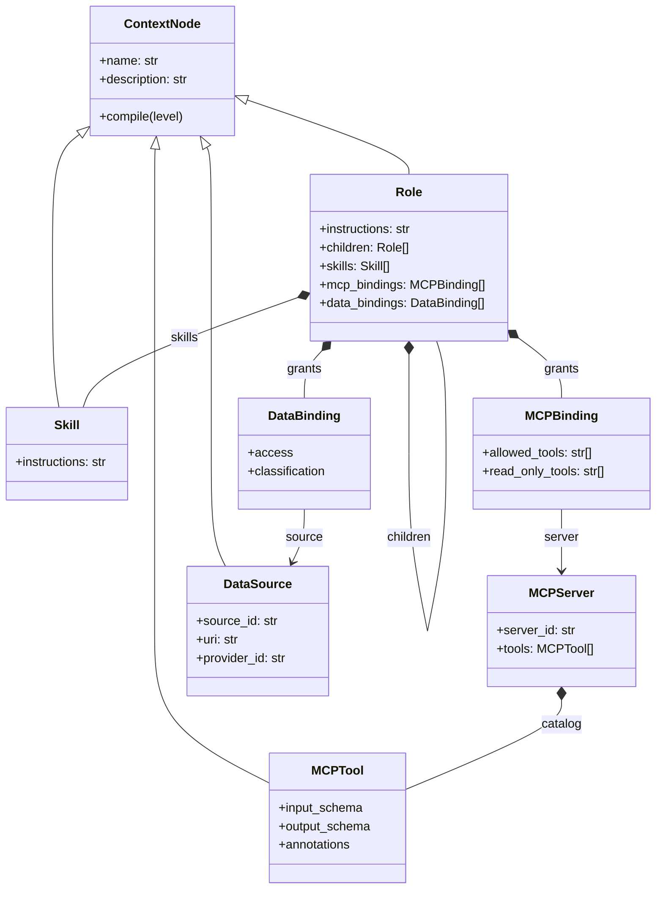

# Design 01 — Progressive Role Object Model

## 1. Purpose

This document records the design reasoning behind the first object model of the
agent-team runtime. It begins with the members introduced during the incremental
design sequence and then shows how those members fit into the terminal project
architecture.

The design targets Python and uses the Model Context Protocol revision
`2026-07-28`, whose wire messages use JSON-RPC 2.0.

The most important architectural separation is:

```text
MCP defines how a Host communicates with capability providers.
This project defines how a Host organizes those capabilities into Roles.
```

`Role`, `Skill`, `ContextNode`, `MCPBinding`, `tool_ref`, and the compile levels
are Host-layer concepts. They are not additions to the MCP wire protocol.

## 2. Design goals

The model should satisfy six goals.

1. A Role must be an ordinary Python object.
2. A Role may contain child Roles through object composition.
3. A Role may reuse Skills without copying their implementation knowledge.
4. A Role may use only an explicitly granted subset of an MCP Server.
5. The Host must progressively expose context instead of loading the complete
   team, every Skill, and every Tool schema at once.
6. One compile interface should work across different context-node types.

The model should remain understandable before adding registries, transports,
policy engines, persistence, or distributed execution.

## 3. Protocol baseline

The formal MCP `2026-07-28` revision is stateless at the protocol core. Every
request is self-contained and carries its protocol version and client
capabilities. MCP messages use JSON-RPC 2.0.

For Tools, the protocol defines concepts such as:

- `tools/list`
- `tools/call`
- Tool `name`
- optional Tool `description`
- required Tool `inputSchema`
- optional Tool `outputSchema`
- optional Tool annotations

The Role model does not redefine these fields. `MCPTool` wraps them so that a
protocol Tool can participate in the Host's progressive context lifecycle.

## 4. The vocabulary

| Type | Question answered | Primary responsibility |
|---|---|---|
| `Role` | Who owns this responsibility? | Coordinate a bounded area of work. |
| `Skill` | How should this class of work be performed? | Supply reusable workflow knowledge. |
| `MCPTool` | Which external function can be invoked? | Describe one protocol-callable operation. |
| `MCPServer` | Which provider owns this Tool catalog? | Own and refresh a catalog of MCP Tools. |
| `MCPBinding` | Which Server capabilities may this Role use? | Project a least-privilege Tool subset. |
| `DataSource` | Which contextual data exists? | Describe addressable data without loading it. |
| `DataBinding` | How may this Role access the data? | Grant read and/or write access. |
| `RoleCompiler` | What should enter the current LLM context? | Produce a progressive context representation. |
| `RoleRuntime` | What may actually execute? | Recheck grants and invoke MCP or data providers. |

A useful shorthand is:

```text
Role       = who
Skill      = how
MCPTool    = executable operation
MCPServer  = operation provider
MCPBinding = granted provider view
DataSource = contextual information descriptor
Compiler   = context disclosure
Runtime    = execution enforcement
```

## 5. Step 1: Role as a recursive composite

The first model required only three members:

```python
@dataclass
class Role:
    name: str
    description: str
    children: list["Role"]
```

`children` is the key object-oriented decision. A child Role is a member object,
not necessarily a Python subclass.

```text
k8s-team
├── k8s-troubleshooter
└── k8s-operator
```

This is composition. It models an operational team structure directly and
allows the same Role type to represent every level of the tree.

Python inheritance would answer a different question:

```text
Is FinancialResearcher a specialized kind of Researcher?
```

Composition answers the team question:

```text
Does ResearchLead contain and coordinate Researcher Roles?
```

The team model primarily needs composition.

## 6. Step 2: routing description versus active instructions

A single prompt field is insufficient because routing and execution have
opposite context requirements.

- `description` should be small and broadly visible.
- `instructions` may be detailed and should become visible only after the Role
  is selected.

```text
description  = when should the Host or model select this Role?
instructions = how should the selected Role behave?
```

This distinction is the foundation of progressive disclosure.

## 7. Step 3: Skill as reusable workflow knowledge

A Role owns a responsibility, but a Skill contains a reusable method.

For example:

```text
Role:  k8s-troubleshooter
Skill: inspect-pod-failure
```

The Skill can explain a sequence such as:

1. Inspect Pod status.
2. Read current logs.
3. Read previous logs after a restart.
4. Inspect Events.
5. Correlate the evidence.

The Skill does not need to own the external functions that perform those steps.
It can guide the model to use several MCP Tools, possibly from several Servers.

This separation prevents workflow knowledge from being copied into every Role
or hard-coded into Tool implementations.

## 8. Step 4: ContextNode and the uniform lifecycle

Once both Role and Skill needed the same route-versus-active lifecycle, the
model introduced `ContextNode`.

```python
class ContextNode(ABC):
    name: str
    description: str

    def compile(self, level): ...
    def _compile_route(self): ...
    @abstractmethod
    def _compile_active(self): ...
```

The base class deliberately does not own every field that happens to appear in
current subclasses.

For example:

- Role active context contains `instructions` plus child routes.
- Skill active context contains `instructions`.
- MCP Tool active context contains `inputSchema`, not instructions.
- Data Source active context contains a URI and descriptor.

The stable abstraction is the lifecycle, not a forced universal payload.

This supports polymorphism:

```python
node.compile("route")
node.compile("active")
```

The caller does not need a growing `isinstance` chain for Role, Skill, Tool, and
Data Source.

## 9. The two compile levels

### 9.1 Route level

The route level is intentionally small:

```json
{
  "kind": "mcp_tool",
  "name": "get_pod_logs",
  "description": "Read logs from a Kubernetes Pod container."
}
```

Its purpose is selection, not execution.

### 9.2 Active level

The active level reveals type-specific details. An active MCP Tool exposes its
schema:

```json
{
  "kind": "mcp_tool",
  "name": "get_pod_logs",
  "description": "Read logs from a Kubernetes Pod container.",
  "inputSchema": {
    "type": "object",
    "properties": {
      "namespace": { "type": "string" },
      "pod": { "type": "string" }
    }
  }
}
```

An active Role does not recursively activate all descendants. It exposes:

- its own instructions;
- direct child Role route cards;
- Skill route cards;
- granted MCP Tool route cards;
- Data Source route cards.

This invariant prevents an accidental full-tree context expansion.

## 10. Why `kind` belongs in the route card

Before Tools existed, a route card containing only `name` and `description` was
sufficient. Once a Role could expose child Roles, Skills, Tools, and Data, the
Host needed to know how the selected item should be activated.

```json
{
  "kind": "skill",
  "name": "inspect-pod-failure",
  "description": "Diagnose a failing Pod."
}
```

`kind` is a Host routing field. It is not an MCP Tool field added to the wire
protocol.

## 11. Step 5: MCPTool as a ContextNode

`MCPTool` represents the protocol Tool declaration needed by the Host and LLM.
Its central fields are:

```python
MCPTool(
    name=...,
    description=...,
    input_schema=...,
    output_schema=...,
    annotations=...,
)
```

The Tool is a descriptor. It is not the network connection and does not own the
transport.

```text
MCPTool describes what can be called.
MCPClient and MCPTransport perform the call.
```

A Tool's route surface omits `inputSchema`. Its active surface includes the full
schema only after selection.

The model validates the MCP invariant that Tool arguments are JSON objects, so
the root of `inputSchema` must use `type: "object"`.

## 12. Step 6: MCPServer is infrastructure, not ContextNode

An MCP Server owns the catalog and provides the execution destination.

```python
MCPServer(
    server_id="production-kubernetes",
    name="kubernetes",
    tools=[...],
)
```

The Server does not inherit `ContextNode` because the LLM normally selects a
business operation, not an infrastructure endpoint.

```text
The LLM selects get_pod_logs.
The Host routes that selection to production-kubernetes.
```

Keeping `MCPServer` outside the context-node hierarchy prevents transport and
connection details from leaking into the LLM-facing abstraction.

## 13. Host `tool_ref` versus protocol Tool name

MCP Tool names are scoped to one Server. Two Servers may both expose `search` or
`get_logs`.

The Host therefore creates a unique reference:

```text
production-kubernetes/get_pod_logs
```

The two names serve different purposes:

```text
tool_ref  = Host-side routing and disambiguation
Tool.name = value sent in MCP tools/call params.name
```

The Host must not accidentally send the full `tool_ref` as the protocol Tool
name unless that exact string is the Server's original Tool name.

## 14. Step 7: MCPBinding as the relationship object

A direct Role-to-Server reference grants too much. If a Server exposes read,
write, and destructive Tools, a read-only Role should not automatically receive
the entire catalog.

`MCPBinding` sits between Role and Server:

```python
MCPBinding(
    server=kubernetes_server,
    allowed_tools=["get_pod_logs", "get_events"],
    read_only_tools=["get_pod_logs", "get_events"],
)
```

The object graph becomes:

```text
Role
└── MCPBinding
    ├── server: MCPServer
    ├── allowed_tools
    └── read_only_tools
```

`allowed_tools` is deny-by-default. An empty list grants no Tool.

`read_only_tools` is a trusted Host classification and must be a subset of
`allowed_tools`. Any allowed Tool not on the trusted read-only list requires
explicit approval in the Runtime.

This second list is part of the terminal implementation. It preserves the simple
allowlist model while providing a concrete confirmation boundary.

## 15. Why protocol ToolAnnotations are not authorization

MCP Tool annotations such as `readOnlyHint` and `destructiveHint` are hints. A
remote Server controls them, so a Host cannot safely treat them as the source of
truth for authorization.

The project keeps annotations for display, planning, and diagnostics, but the
execution policy uses the Host-owned Binding.

```text
Remote annotation = untrusted hint
Host Binding       = trusted grant and classification
```

## 16. Current object graph



## 17. Terminal-state additions

The project includes the natural next layers so the current model does not need
to be redesigned later.

### 17.1 DataSource and DataBinding

`DataSource` is a descriptor and a ContextNode. Its route card describes the
data without revealing its URI. Its active form reveals the descriptor, URI,
provider, media type, and optional schema, but still does not load content.

`DataBinding` grants `read`, `write`, or `read_write` access and carries a Host
classification.

Actual content is loaded through a `DataProvider` only after Runtime
authorization.

### 17.2 RoleCompiler

The compiler receives a `CompileRequest` and optional `CapabilitySelection`.

```python
CompileRequest(
    selection=CapabilitySelection(
        skill_names=("inspect-pod-failure",),
        tool_refs=("production-kubernetes/get_pod_logs",),
        data_refs=("runbook/kubernetes-incidents",),
    )
)
```

The result contains:

- the active Role surface;
- only the selected active Skill details;
- only the selected active Tool schemas;
- only the selected active Data descriptors.

The compiler never executes a Tool and never reads data. It produces context.

### 17.3 RoleRegistry

The registry resolves explicit paths such as:

```text
k8s-team/k8s-troubleshooter
```

It also detects recursive object-composition cycles. Shared Role objects may be
reachable through multiple paths, but a Role cannot eventually contain itself.

### 17.4 RoleRuntime

The Runtime is the execution boundary.

For an MCP call, it performs this sequence:

```text
Resolve active Role path
        ↓
Resolve Role's MCPBinding from tool_ref
        ↓
Verify the Tool is explicitly allowed
        ↓
Check the Host read-only classification
        ↓
Require approval when necessary
        ↓
Select MCPClient by server_id
        ↓
Send tools/call with the original Tool.name
```

The Runtime checks the Binding again even though ungranted Tools were already
hidden from the LLM context. Context omission improves behavior; Runtime checks
provide the actual Host boundary.

### 17.5 MCPClient and MCPTransport

`MCPClient` builds self-contained requests with:

- `jsonrpc: "2.0"`;
- a non-null request id;
- the MCP method;
- required per-request `_meta` values;
- the protocol version `2026-07-28`;
- client implementation information;
- per-request client capabilities.

For Streamable HTTP, it builds the required routing headers:

- `MCP-Protocol-Version`;
- `Mcp-Method`;
- `Mcp-Name` where required;
- `Mcp-Param-*` values derived from valid `x-mcp-header` annotations.

The transport interface is separate so an application can use HTTP, stdio, a
mock transport, or another implementation without changing the Role model.

## 18. Complete progressive flow

A typical request follows this sequence:

```text
1. Compile k8s-team as active.
   - Root instructions are visible.
   - Child Role descriptions are visible.
   - Child instructions remain hidden.

2. Select k8s-troubleshooter.

3. Compile k8s-troubleshooter as active.
   - Troubleshooter instructions are visible.
   - Skill descriptions are visible.
   - granted Tool descriptions are visible.
   - Data descriptions are visible.
   - Skill instructions, Tool schemas, and Data URIs remain hidden.

4. Select inspect-pod-failure and get_pod_logs.

5. Compile selected capabilities as active.
   - Skill instructions enter context.
   - get_pod_logs inputSchema enters context.
   - unrelated Tool schemas remain hidden.

6. The LLM produces Tool arguments.

7. RoleRuntime checks the MCPBinding again.

8. MCPClient sends tools/call to the bound Server using Tool.name.

9. The Tool result is returned to the Host and can be added to the next LLM turn.
```

## 19. Core invariants

The implementation protects these invariants.

### Progressive-disclosure invariants

1. `route` never contains type-specific detailed execution content.
2. An active Role does not recursively activate descendants.
3. A selected capability is activated explicitly by the compiler.
4. Reading Data content is separate from compiling a Data descriptor.

### Object-model invariants

1. Direct child Role names are unique within one Role.
2. Skill names are unique within one Role.
3. One Role has at most one Binding for a given Server id.
4. Data source ids are unique within one Role.
5. Role composition cannot contain cycles.

### MCP invariants

1. Tool names are unique within one Server catalog.
2. Tool `inputSchema` has an object root.
3. A Binding cannot grant a Tool absent from the Server catalog.
4. `read_only_tools` is a subset of `allowed_tools`.
5. `tool_ref` is used for Host routing only.
6. Every MCP request carries protocol metadata for `2026-07-28`.

### Security invariants

1. Hidden is not the same as unauthorized.
2. The Runtime rechecks grants immediately before execution.
3. Remote Tool annotations are not trusted authorization facts.
4. Non-read-only Tools require explicit approval in the reference Runtime.
5. The Server must still enforce its own authentication and authorization.

## 20. Why direct objects are retained in this starter

The current model stores direct Python objects:

```python
Role(children=[child_role])
MCPBinding(server=server)
DataBinding(source=data_source)
```

This is intentional because the goal is to make the object relationships easy
to understand.

A persisted or distributed system will likely split declaration and runtime:

```text
RoleSpec with stable references
        ↓ resolve/link
Role runtime objects with live clients and providers
```

The included Registry, Client map, and Provider map already establish the
boundaries needed for that future split. The core Role API does not need to
change when serialization is introduced.

## 21. Extension points

The terminal structure supports the following additions without changing the
core object hierarchy:

- persisted `RoleSpec` documents and versioned references;
- Skill packages loaded from local directories or registries;
- MCP Resources and Prompts;
- automatic multi-round-trip request handling;
- stdio transport;
- token-budget-aware context compilation;
- richer confirmation and organization policy engines;
- observability, audit events, and deterministic fingerprints;
- parallel child Role execution;
- team-level scheduling and shared workspaces.

Each belongs behind an existing boundary rather than inside the base Role class.

## 22. Deliberate non-goals

This starter does not attempt to be a full MCP SDK or a complete multi-agent
orchestrator. In particular, it does not automatically implement every optional
MCP feature, LLM provider adapter, persistence backend, distributed scheduler,
or authorization system.

Its purpose is narrower and architectural:

```text
Provide a coherent, runnable object model that can grow from a simple Role tree
into a secure progressive Agent Host without invalidating the early concepts.
```

## 23. Code map

| Design concept | Source file |
|---|---|
| Context lifecycle | `src/role_runtime/context.py` |
| Skill | `src/role_runtime/skill.py` |
| Role | `src/role_runtime/role.py` |
| Data model | `src/role_runtime/data.py` |
| MCP Tool and Server | `src/role_runtime/mcp/models.py` |
| MCP Binding | `src/role_runtime/mcp/binding.py` |
| JSON-RPC and request metadata | `src/role_runtime/mcp/protocol.py` |
| MCP transport | `src/role_runtime/mcp/transport.py` |
| MCP client | `src/role_runtime/mcp/client.py` |
| Unified compiler | `src/role_runtime/compiler.py` |
| Role path registry | `src/role_runtime/registry.py` |
| Execution runtime | `src/role_runtime/runtime.py` |
| Complete example | `examples/kubernetes_team.py` |

## 24. Official references

- MCP specification: https://modelcontextprotocol.io/specification/2026-07-28
- Architecture: https://modelcontextprotocol.io/specification/2026-07-28/architecture
- Tools: https://modelcontextprotocol.io/specification/2026-07-28/server/tools
- Streamable HTTP: https://modelcontextprotocol.io/specification/2026-07-28/basic/transports/streamable-http
- Schema reference: https://modelcontextprotocol.io/specification/2026-07-28/schema
